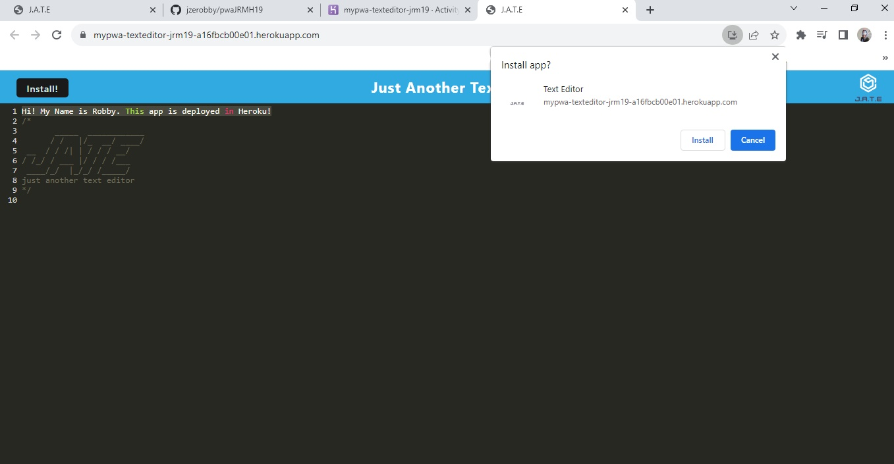

# Homework 19 Jzero's PWA Text Editor

## Description

I build a text editor that runs in the browser. This app will be a single-page application that meets the PWA criteria. Additionally, it will feature a number of data persistence techniques that serve as redundancy in case one of the options is not supported by the browser. The application will also function offline. This text editor, I started with an existing application and implemented methods for getting and storing data to an IndexedDB database. I used a package called `idb`, which is a lightweight wrapper around the IndexedDB API. It features a number of methods that are useful for storing and retrieving data, and is used by companies like Google and Mozilla.

## Application Screenshot

## Links

App in Heroku: https://mypwa-texteditor-jrm19-a16fbcb00e01.herokuapp.com/

Repo in Github: https://github.com/jzerobby/pwaJRMH19